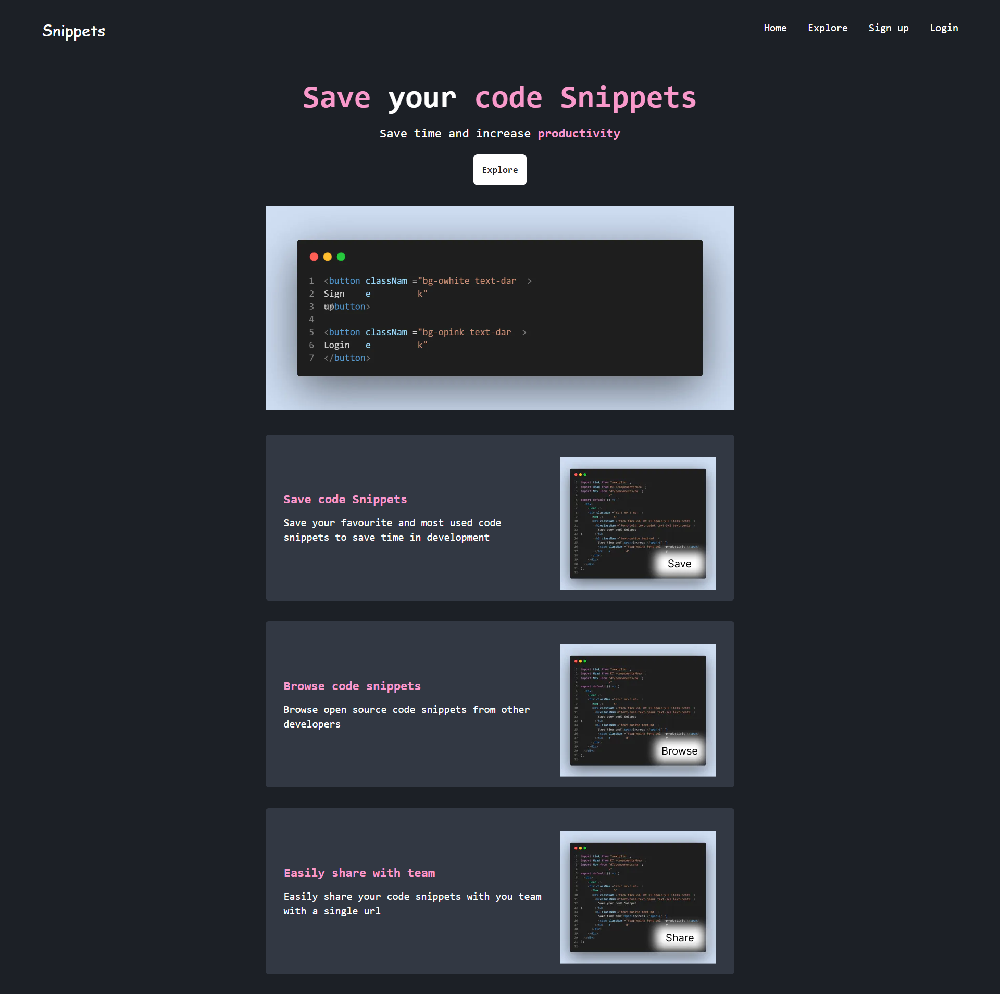

# Codepets

This is an app designed to store and browse through a collection of your most used code snippets.

## 👨‍💻 Demo

Explore the app functionality [here](https://codepets.netlify.app/).



### ✏️ Design File

Interested in the design of this app? Check out the [Figma file](https://www.figma.com/file/asYmiNQAfRLMNSvk5eecN6/Untitled?node-id=0%3A1).

### ⚒️ Technologies Used

This project was built using the following technologies:

- React
- NextJS
- Tailwind

### 👇 Prerequisites

To get this project up and running locally, you must already have installed the following packages on your computer.

- [Node.js](https://nodejs.org/en/)
- [Git](https://git-scm.com/)

### 🛠️ Contribution Guidelines

Want to contribute to this project? Follow the steps below to set up the project locally.

1. Fork this repository.
2. Clone your forked repository to your local machine.

```
git clone https://github.com/<your-github-username>/snippets.git
```

3. Navigate to the project directory:

```
cd codepets
```

4. Install the dependencies:

```
npm install
```

5. Create a new branch:

```
git checkout -b <your-branch-name>
```

At this point, you can now modify existing files or add new files to the project on your own branch.

6. Stage your changes and commit

Once you have modified existing files or added new files to the project, you can add them to your local repository, which you can do with the `git add` command.

_Add changes_

```
git add .
```

_Commit changes_

```
git commit -m "commit message"
```

7. Push your changes to GitHub:

```
git push -u origin <your-branch-name>
```

# ❗ Reminder

Don't forget to drop a star ✨ while you're here!
